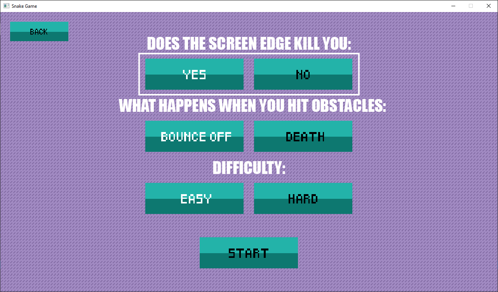

# SnakeGame

Traditional snake game implemented using [Engine](https://github.com/sobajic/MATFgame) made on school classes.

### Contributors:
- [Đorđe Tanasković](https://github.com/djordjetane)  
- [Aleksa Veselić](https://github.com/SgtCroWbaR)  
- [Ivana Jovičić](https://github.com/Anavi93)  
- [Marko Vesković](https://github.com/inf000)

### Ingame Screenshots:

### Game options:
